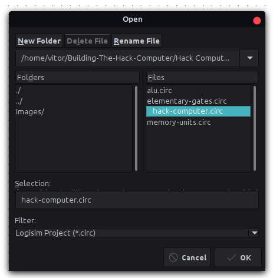

<!-- PROJECT LOGO -->
<br />
<p align="center">
  <a href="https://github.com/VitorgsRuffo/Building-The-Hack-Computer">
    
  </a>

  <h3 align="center">Building the Hack Computer</h3>

  <p align="center">
    This is a personal project which purpose is to learn computer architecture by implementing the Hack Computer.
    <br />
  </p>
</p>


<!-- TABLE OF CONTENTS -->
<details open="open">
  <summary>Table of Contents</summary>
  <ol>
    <li>
      <a href="#about-the-project">About The Project</a>
    </li>
    <li>
      <a href="#getting-started">Getting Started</a>
      <ul>
        <li><a href="#prerequisites">Prerequisites</a></li>
      </ul>
    </li>
    <li><a href="#usage">Usage</a></li>
    <li><a href="#contributing">Contributing</a></li>
    <li><a href="#contact">Contact</a></li>
  </ol>
</details>


<!-- ABOUT THE PROJECT -->
## About The Project

/Images/hack-computer.png)

This is a personal project which purpose is to learn computer architecture by implementing the Hack Computer (Noam Nisan and Shimon Schocken. 2008. <i>The Elements of Computing Systems: Building a Modern Computer from First Principles (History of Computing S.)</i>. The MIT Press).

The aforementioned book, a.k.a NandToTetris, aims to take the reader on a journey to build a simple but powerful 16-bit general-purpose computer. It gives you the knowledge and tools to gradually and modularly implement it from the ground up. The reader starts by building elementary logic gates, such as NOT, AND, OR, ..., and goes all the way until he/she can run high-level applications, as the classic Tetris game, on the computer that has been built. 

I have only read the book until the 5th chapter in which the system hardware is already implemented and ready to run low-level code. Firstly, I have described the computer in a Hardware Description Language (HDL) by following the book instructions [(check out computer description)](./Hack-Computer-description-in-HDL). Then, I have implemented the computer in Logisim, which is an educational software to simulate logic gates [(check out the Logisim project)](./Hack-Computer-(Logisim)). This book is awesome and presents many computer architecture fundamental concepts, I recommend it to everyone interested in computer science.

<!-- GETTING STARTED -->
## Getting Started

The computer description in HDL can be interpreted and tested by using the software suite provided by the book. But, its implementation in Logisim is a thing that I have done by myself, so let's see how you can get a local copy of that project and run it.

### Prerequisites

1. Go to [this website](http://www.cburch.com/logisim/download.html) and follow the instructions to install Logisim.
  
2. Clone this repo:
   ```sh
   git clone https://github.com/VitorgsRuffo/Building-The-Hack-Computer.git
   ```

<!-- USAGE EXAMPLES -->
## Usage

1. Open Logisim and inside it open the "hack-computer.circ" file located at "/path/to/repository/Building-The-Hack-Computer/Hack Computer (Logisim)":

<a href="https://github.com/VitorgsRuffo/Building-The-Hack-Computer">
    
</a>

<br />

2. Click on the Hack Computer chip:
<a href="https://github.com/VitorgsRuffo/Building-The-Hack-Computer">
    
</a>

<br />

3. Go to the Simulate option on Logisim's menu and enable clock ticks:
<a href="https://github.com/VitorgsRuffo/Building-The-Hack-Computer">
    
</a>

4. The computer will start to run the program that is preloaded in its ROM. After the first four intructions, value 10 gets loaded at RAM's 6th address. The 2 last instructions are there to avoid that the computer runs garbage instructions stored at subsequential ROM addresses, compromising the result of the actual program.

<br />

5. By inspecting RAM chip we can see that the value 10 has actually been loaded at RAM's 6th address.
<a href="https://github.com/VitorgsRuffo/Building-The-Hack-Computer">
    
</a>

<br />

The book's 4th chapter defines the computer machine language. After understanding it you can write machine-level programs, load them into ROM chip and get the computer to run your program. For more information, check out the book.

<!-- CONTRIBUTING -->
## Contributing

Contributions are what make the open source community such an amazing place to be learn, inspire, and create. Any contributions you make are **greatly appreciated**.

1. Fork the Project
2. Create your Feature Branch (`git checkout -b feature/AmazingFeature`)
3. Commit your Changes (`git commit -m 'Add some AmazingFeature'`)
4. Push to the Branch (`git push origin feature/AmazingFeature`)
5. Open a Pull Request


<!-- CONTACT -->
## Contact

Vitor G. S. Ruffo - [LinkedIn](https://www.linkedin.com/in/vitor-ruffo-8211731b6/) - vitor.gs.ruffo@gmail.com

